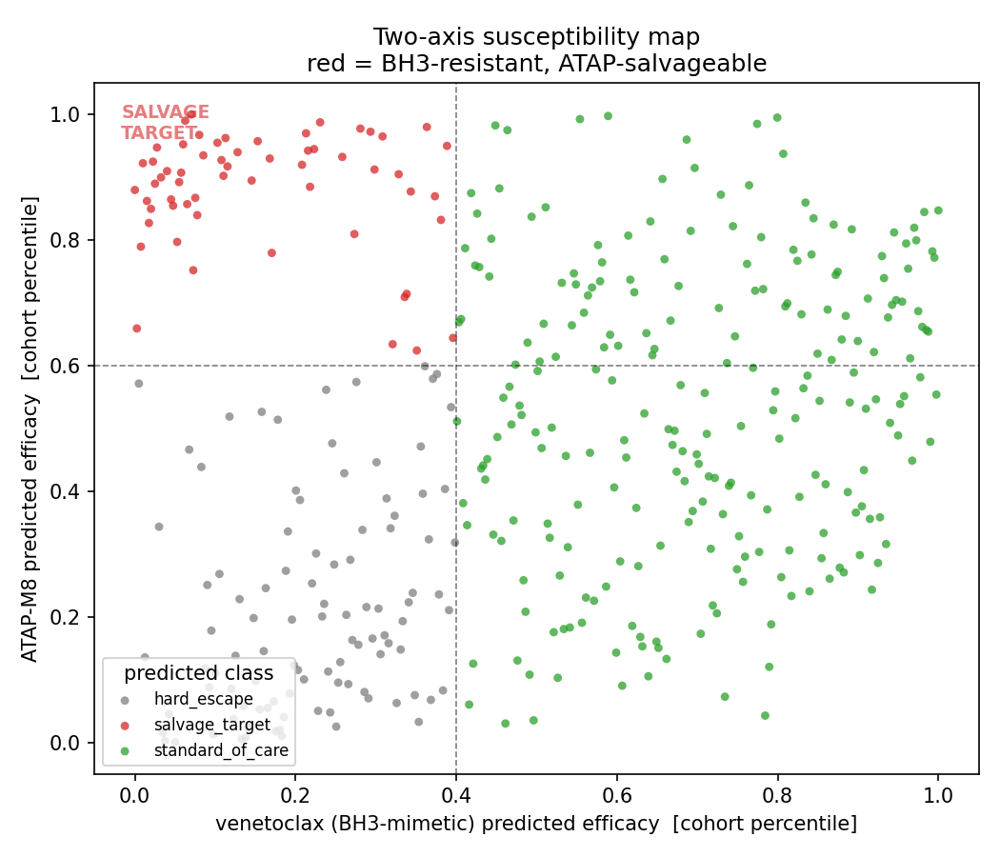
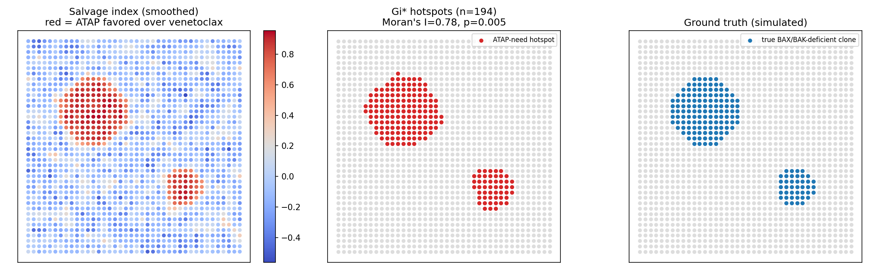

# ATAP-M8 as a BAX-independent salvage therapy for BH3-mimetic-resistant blood cancers

**A computational map of who is susceptible, and where.**

Venetoclax and the next-generation MCL-1 inhibitors are the backbone of modern
blood-cancer therapy, and they share a single mechanical dependency: they all kill
through the pore-forming effectors **BAX and BAK**. BH3-mimetics only *release the
brake* — they occupy the BH3 groove of an anti-apoptotic guardian (BCL-2, BCL-XL,
MCL-1); BAX/BAK still have to punch the mitochondrial pore. So when a leukemia or
lymphoma loses functional BAX/BAK — **a documented resistance mechanism in relapsed
AML and CLL** — the entire drug class fails at the same step, regardless of which
guardian the drug targets.

**ATAP-M8** (an engineered variant of the Amphipathic Tail-Anchoring Peptide from the
BFL-1/BCL2A1 tail-anchor) permeabilizes the mitochondrial membrane *itself*. It is the
effector; it needs no BAX/BAK and competes for no BH3 groove. Its predicted therapeutic
window is therefore exactly where the BH3-mimetic class is mechanically dead:
BAX/BAK-deficient, but with mitochondria and the downstream apoptosome/caspase
machinery still intact to convert membrane permeabilization into death.

ATAP has only ever been studied in old, solid-tumor work. This project is the first to
connect it to BH3-mimetic-resistant blood cancers — and, critically, it does not just
re-show the bypass. It **predicts** which venetoclax-resistant tumors are ATAP-
susceptible from their BAX/BAK/priming state, and **localizes** where within a tumor a
BAX-independent agent is needed versus where venetoclax still works. Predict-and-map is
what makes this a new result rather than a tissue-swap of a decade-old finding.

---

## The two-axis model

Every sample (or spatial spot) is scored on two independent axes built transparently
from BCL-2-family biology (`src/atap/biology.py`):

- **Venetoclax (BH3-mimetic) axis** — rises with BCL-2 dependence, priming, functional
  BAX/BAK, and intact execution; falls with MCL-1/BCL-XL guardian-switching or a BCL-2
  gatekeeper mutation.
- **ATAP-M8 axis** — rises with priming, mitochondrial mass, and intact execution, and
  is **indifferent to the guardian axis**. The one block that separates the two agents:
  effector competence (BAX/BAK) contributes **+1** to venetoclax and **−1** to ATAP.

That single sign flip is the whole thesis, and it produces the clinically actionable
quadrant map:

| Predicted class | Meaning | Action |
|---|---|---|
| `standard_of_care` | venetoclax predicted to work | use the BH3-mimetic |
| **`salvage_target`** | **BH3-resistant, ATAP-salvageable** | **the ATAP-M8 window** |
| `hard_escape` | downstream execution lost → both agents fail | neither (flag) |

`hard_escape` is what keeps the model honest: it is *not* a blanket "BAX-low ⇒ kill with
ATAP" call. If the shared apoptosome/caspase bottleneck is silenced, the model predicts
ATAP fails too.



## The spatial layer

A tumor is not uniform. A biopsy that reads venetoclax-sensitive in bulk can still
harbor BAX/BAK-deficient pockets that seed relapse. `src/atap/spatial.py` scores every
spot in a spatial-transcriptomics slide on the same two axes, then uses Moran's I and
Getis-Ord Gi\* hotspot statistics to delineate the contiguous regions where a
BAX-independent agent is predicted to be needed.



*(Applies spatial-transcriptomics analysis to this ATAP question; the underlying
spatial methodology is developed separately in the MOSAIC work.)*

---

## Reproduce

The pipeline runs today on a **schema-faithful simulator** whose covariance structure
encodes the hypothesis, so susceptibility recovery is a real check on the scoring logic
rather than a tautology. Swapping in real DepMap / BeatAML / TCGA data is a one-flag
change (`docs/DATA.md`).

```bash
pip install -r requirements.txt

python scripts/01_predict_bulk.py            # bulk prediction + validation + map
python scripts/02_spatial_map.py             # intratumoral ATAP-need hotspot map
python tests/test_pipeline.py                # sanity checks

# once data/raw is populated (see docs/DATA.md):
python scripts/01_predict_bulk.py --cohort beataml
```

Current validation on the simulated cohort:

- **Bulk:** `salvage_target` recovered at precision ≈ 0.81, recall ≈ 0.72 against the
  hidden BAX/BAK-loss, execution-intact ground truth.
- **Spatial:** predicted ATAP-need hotspot recovers the planted resistant clone at
  Jaccard ≈ 0.88, Moran's I = 0.78 (p = 0.005).

## Layout

```
src/atap/
  biology.py    # BCL-2-family gene sets + directional priors (the mechanism, as data)
  features.py   # omics -> mechanistic feature blocks; mutation overrides for BAX/BAK LoF
  scoring.py    # transparent two-axis model, quadrant calls, per-sample audit trail
  data.py       # DepMap/BeatAML/TCGA loaders + schema-faithful simulator (interchangeable)
  spatial.py    # spot-level scoring + Moran's I / Getis-Ord Gi* hotspot detection
scripts/        # 01 bulk prediction, 02 spatial map
tests/          # mechanistic sanity checks
docs/DATA.md    # exact download instructions for the real cohorts
```

## Where this sits in the larger project

This repository is the **computational spine** — the predict-and-map layer that is the
project's own contribution regardless of wet-lab access. The intended validation is a
single wet-lab experiment: test ATAP-M8 on a BAX-deficient, venetoclax-resistant
blood-cancer line and confirm one specific `salvage_target` prediction from this map.

> Status: mechanistic model + spatial pipeline validated on structured synthetic data.
> Next: run against BeatAML (matched RNA-seq + venetoclax ex-vivo response) to test
> whether predicted salvage-targets are the venetoclax-resistant patients.
